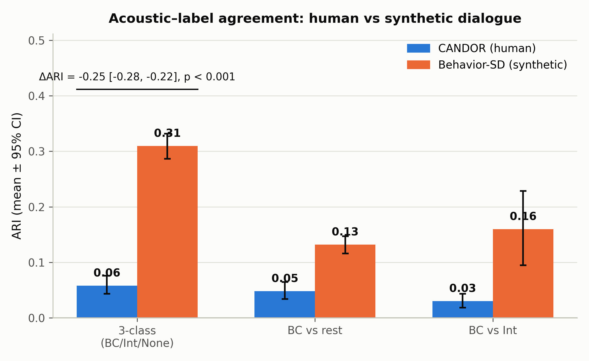
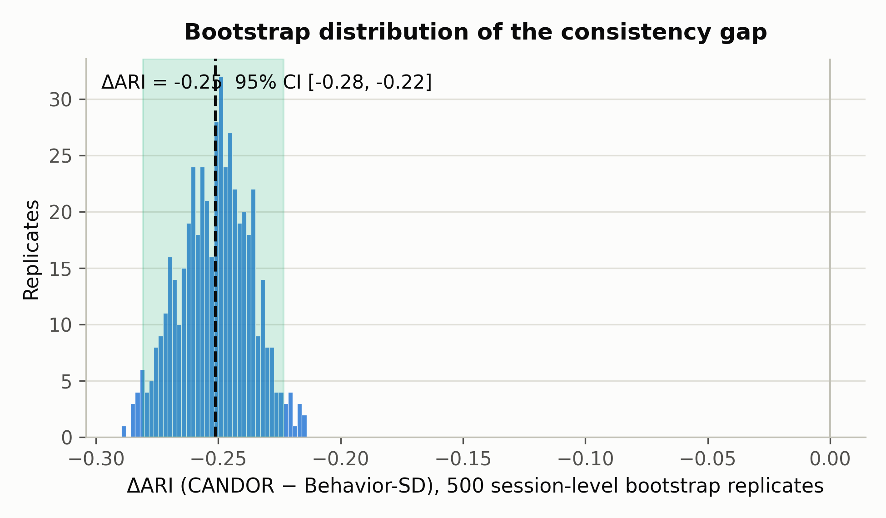
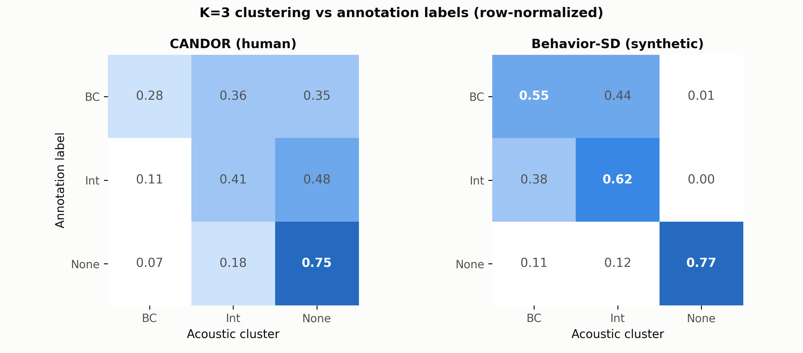
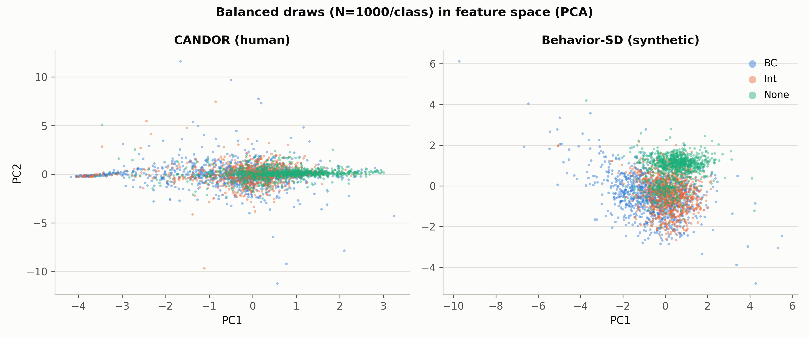
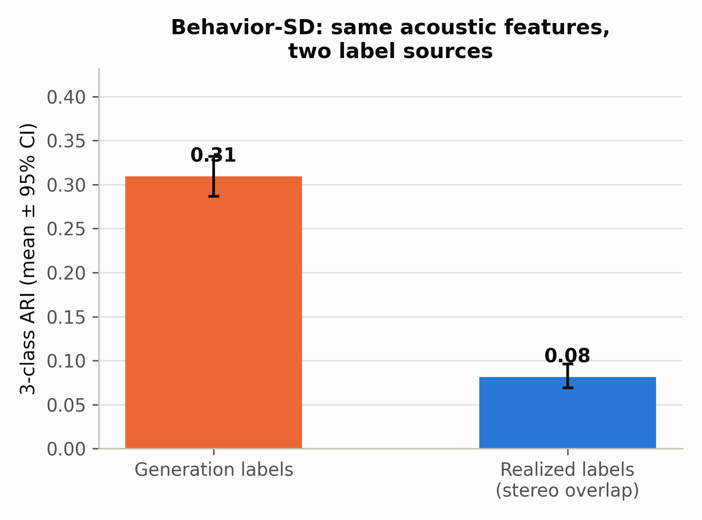

# ARI 实验报告：人类 vs 合成对话的声学-语义一致性

> **实验日期**：2026-08-23 ～ 2026-08-24
> **执行**：DeepSeek（脚本 `pilot_study/scripts/ari_*.py`，计算全部在 gpu02 作业内完成）
> **数据**：CANDOR（1656 会话）+ Behavior-SD（validation/test 全量 + train 前 8 tar）
> **配套指南**：[2026-08-23_ari_exp_guidance.md](2026-08-23_ari_exp_guidance.md)（本文档为该指南的修复版执行结果）

---

## 1. 目标与定位

**本实验回答的问题**：人类对话 (CANDOR) 与合成对话 (Behavior-SD) 的**声学特征与行为标签的一致程度**相差多少？

**明确定位（经实验策划者确认）**：这是"**可视化人类 vs 合成数据的声学-语义一致性差距**"，
**不是**"验证渲染层失真"——渲染失真此前已由 `verify_backchannel.py` 的声道级 RMS 裁决
直接证明（BC 标称 4-5s、真实同时发声仅 ~0.6s）。ARI 实验是对该差距的一个汇总性定量指标。

**注意**：指南文档中的核心假设（`ARI_CANDOR > ARI_Behavior-SD`）在修复设计缺陷后**不成立**，
实际方向相反，详见 §4。

## 2. 方法

### 2.1 相对指南文档的修复（全部落实）

| 指南中的硬伤 | 本实验的修复 |
|---|---|
| 单声道混音毁掉 BC/宿主对比信息 | **声道级**：CANDOR 用 `channel_map.json`，Behavior-SD 用 speaker_idx→声道（已验 96.6% 可分离） |
| 非 BC 样本特征为常数（host=自己） | 三类事件**完全同口径**：event 声道 vs 对方声道同一时间窗 |
| duration 特征与标签定义循环 | **不含 duration**；特征 5 个：log10 能量比、F0 相关性、F0 斜率、频谱质心、有声帧占比 |
| K=2 对 3 类标签、ARI 天花板不可比 | K=3 三分类为主指标；附加 BC-vs-rest、BC-vs-Int 二分类；**类别平衡 1:1:1 抽样** |
| 显著性检验空缺/伪造 | 以**会话(CANDOR)/文件(Behavior-SD)为单位** bootstrap B=500，报告 95% CI 与 p 值；permutation 基线 |
| 标签来源混杂（ASR 派生 vs 生成意图） | Behavior-SD 内部加 **realized 标签对照**（声道级双活跃裁决，与 `verify_backchannel.py` 同口径） |
| 事件单元不统一 | 统一为**事件级**：CANDOR 取 backbiter 的 BC 事件 + audiophile 的 Int/None turn；Behavior-SD 取嵌套 backchannels + utterance 级交叠 |

### 2.2 事件定义

- **CANDOR**：BC = backbiter 的 `backchannel_start/stop`（窗口截断至 0.15-3.0s，剔除合并标注的长簇）；
  Int = audiophile `overlap=True` 且 dur>0.3s；None = `overlap=False` 且 dur>0.5s。
  Int/None 排除"即 BC 事件本身"的 turn（起止与 BC 窗口 ±0.3s 内一致者），每会话各限 30 条。
- **Behavior-SD**：BC = 嵌套 `backchannels[]` 事件（听者声道）；Int = 在对方话轮进行中开始
  （剩余重叠 ≥0.1s）且 dur>0.3s 的 utterance；None = 与对方 utterance 无 >0.1s 重叠且 dur>0.5s。
  每文件 Int/None 各限 30 条。
- 特征提取：16 kHz，yin 提 F0（fmin 50 / fmax 500），有声帧门控 = 帧 RMS > 0.01
  （两数据集均为响度归一化录音，0.01 ≈ -20 dB）。CANDOR 用 libsndfile 窗口级 seek 读取
  （每会话 130+ 事件仅 ~14s，全量解码需 ~76s）。

### 2.3 统计

- 主指标：三分类 ARI（K=3，每类 N=1000）；次指标：BC-vs-rest（1000:1000）与 BC-vs-Int（1000:1000）。
- 每轮 bootstrap：以会话/文件为单位有放回重抽样 → 平衡抽取事件 → StandardScaler + KMeans。
- permutation 基线：同 X 打乱标签的 ARI（应为 ~0）。
- ΔARI 的 95% CI 取 bootstrap 分布的 2.5/97.5 百分位；p = 2×min(P(Δ≤0), P(Δ≥0))。

### 2.4 数据规模

| 数据集 | 事件数 | 单元数 | BC / Int / None |
|---|---|---|---|
| CANDOR | 204,454 | 1,656 会话（全量） | 106,376 / 49,335 / 48,743 |
| Behavior-SD | 113,750 | 5,857 文件（val 932 + test 925 + train 前 8 tar 4,000） | 32,848 / 10,404 / 70,498 |

## 3. 结果

### 3.1 主指标（B=500，N=1000/类，均值 [95% CI]）

| 指标 | CANDOR（人类） | Behavior-SD（合成） |
|---|---|---|
| **三分类 ARI（K=3）** | **0.058 [0.043, 0.076]** | **0.309 [0.287, 0.332]** |
| BC vs rest（K=2） | 0.048 [0.034, 0.065] | 0.132 [0.116, 0.147] |
| BC vs Int（K=2） | 0.030 [0.018, 0.043] | 0.160 [0.095, 0.229] |
| permutation 基线（三分类） | ≈ 0.000 | ≈ 0.000 |
| Silhouette（三分类） | 0.214 | 0.255 |

**ΔARI（三分类）= CANDOR − Behavior-SD = −0.251 [−0.281, −0.223]，p < 0.001**




### 3.2 每类特征均值（解释差距的直接来源）

| 数据集 | 类别 | log10能量比 | F0相关性 | F0斜率(Hz/s) | 频谱质心(Hz) | 有声帧占比 |
|---|---|---|---|---|---|---|
| CANDOR | BC | 0.08 | 0.004 | −61.2 | 1419 | 0.69 |
| | Int | 0.37 | 0.005 | −28.5 | 1507 | 0.81 |
| | None | 1.42 | 0.002 | −18.0 | 1599 | 0.84 |
| Behavior-SD | BC | 0.29 | −0.005 | −13.8 | 1548 | 0.80 |
| | Int | 0.56 | −0.028 | −11.4 | 1863 | 0.87 |
| | None | **4.03** | −0.003 | −15.7 | 1833 | 0.83 |

差距的直接来源是 **log10 能量比**：Behavior-SD 的 None 事件对方声道接近静音（4.03 ≈ 万倍能量比），
而 CANDOR 的 None 事件对方声道仍有明显能量（1.42）——真实录音的串扰/背景声模糊了
"有无对方语音"这条最强的判别线索。

⚠️ **更正（2026-08-25，见 [E 实验](2026-08-25_ari_e_prosody_text.md)）**：表中
f0_slope 均值对比（−61 vs −14 Hz/s）曾被解读为"人类 BC 音高下降更明显"，该解读
不成立——均值被少数强降调的强调性 BC 拉低。按文本对齐后的中位数：人类 BC 各文本
均 ≈ 平坦（中位 −7.7），合成 BC 反而是词汇驱动模板化语调（整体中位 −29.2，
okay/hmm/nice 强降、mhm/really 强升）。真正的韵律差异是"文本无关 vs 文本驱动"
而非"降幅大小"。本节其余结论不受影响。

**跨数据集分布偏移（每类每特征 Cohen's d，Behavior-SD − CANDOR，事件级）**：

| 类别 | log10能量比 | F0相关性 | F0斜率 | 频谱质心 | 有声帧占比 |
|---|---|---|---|---|---|
| BC | +0.19 | −0.03 | +0.07 | +0.20 | +0.33 |
| Int | +0.23 | −0.10 | +0.05 | +0.63 | +0.29 |
| **None** | **+1.57** | −0.03 | +0.02 | +0.55 | −0.08 |

唯一的大偏移是 None 类的能量比（d=1.57）——"静音捷径"的效应量形式：
合成数据的无重叠 turn 对方声道接近静音，人类数据没有这个属性（见 B/C 实验）。

### 3.3 混淆矩阵与特征空间（固定种子平衡抽样，每类 1000）




- CANDOR：三类在特征空间中高度重叠，聚类几乎无法区分（行归一混淆矩阵接近均匀）。
- Behavior-SD：BC 簇（73%）与 None 簇（81%）可恢复，Int 居中分散。

**每类召回率与平均簇纯度**（平衡抽样 N=1000/类，最优簇-类指派后）：

| 数据集 | BC 召回 | Int 召回 | None 召回 | 平均簇纯度 |
|---|---|---|---|---|
| CANDOR | 0.281 | 0.407 | 0.746 | 0.503 |
| Behavior-SD | 0.549 | 0.617 | 0.769 | 0.679 |

注意：CANDOR 的 None 召回（0.746）并不低——None 类在两数据集中都相对可辨；
真正的差距在 BC（0.28 vs 0.55）与 Int（0.41 vs 0.62）的可恢复性上。

### 3.4 Behavior-SD 内部对照：generation vs realized 标签



- **ARI(generation 标签) = 0.309 ≫ ARI(realized 标签) = 0.081 [0.069, 0.096]**。
- 即：声学特征与"生成端事件类型"的吻合度，显著高于与"声道级双活跃裁决"的吻合度。
- 注：realized-ARI 存在**标签空间坍塌**（BC 渲染进停顿与真正的 None 同标为 realized=None），
  该数字需配合 A1/A2 的类内判别结果解读（见 §3.5）。

### 3.5 后续验证摘要（A1/A2/B/C/D/E，全部 2026-08-25 完成）

| 实验 | 问题 | 关键结果 | 报告 |
|---|---|---|---|
| A1 类内判别 | 真重叠的 BC/Int 与停顿内的同形事件在自身韵律上是否可分？ | 仅能量比可分（构造性）；纯韵律特征 AUC 0.58/0.53 ≈ 随机；f0_slope 组间 d=0.002 | [A1](2026-08-25_ari_a1_within_class.md) |
| A2 连续化 | A1 是否依赖裁决阈值？ | 低 τ（任何重叠）≈ 随机（A1 稳健）；高 τ（实质重叠）韵律可分性上升（0.64/0.73） | [A2](2026-08-25_ari_a2_continuum.md) |
| B 特征消融 | ΔARI 由哪些特征承载？ | energy_only 0.314 ≈ 全量；去能量比坍缩到 0.050；其余特征两数据集均 ≈ 随机 | [B](2026-08-25_ari_b_ablation.md) |
| C 跨数据集迁移 | 静音捷径能否迁移到真实录音？ | B→C F1 0.447（域内 0.718）；去能量比 0.344≈随机；**C→B 0.636 > CANDOR 域内 0.524** | [C](2026-08-25_ari_c_transfer.md) |
| D 人类基线强化 | CANDOR 低 ARI 是数据质量还是特征不足？ | 干净档+z-score 最强变体仅 0.074；BC-vs-Int 不动（0.030）——特征不足为主 | [D](2026-08-25_ari_d_human_baseline.md) |
| E 韵律-文本对照 | 合成 BC 的音高是否"更平"？ | **部分推翻均值解读**：人类 BC 文本无关地平坦；合成 BC 词汇驱动模板化（mhm/really 强升，语用不当） | [E](2026-08-25_ari_e_prosody_text.md) |

## 4. 解读（含后续验证 A1-E 的整合结论）

1. **方向与指南假设相反**：合成数据 (Behavior-SD) 的声学-标签一致性约为人类数据 (CANDOR) 的
   **5 倍**（0.31 vs 0.06），差距大且稳定（bootstrap CI 完全不重叠，p < 0.001）。
2. **差距的构成与量化**（后续实验把推断升级为证据）：
   - **静音捷径（主因，B/C 已证）**：Behavior-SD 的 ARI 几乎全部由 log10 能量比单特征承载
     （0.314 ≈ 全量 0.309；去掉后坍缩到 0.050）。None 类能量比的跨数据集偏移 d=1.57 是
     唯一的大分布偏移。该捷径跨数据集迁移时退化（F1 0.72→0.45）且去能量比后归零。
   - **标签来源（C/D 支持）**：CANDOR 标签由 AWS Transcribe 派生（噪声大）；但 D 显示
     清洗声道/说话人标准化只能把 ARI 从 0.058 提到 0.074——标签噪声不是 CANDOR 低 ARI
     的全部原因，**这套特征对人类 BC/Int/None 的无监督结构上限就在 ~0.07**。
   - **编码与串扰（D 支持）**：干净档 vs 嘈杂档 ARI 0.063 vs 0.046，方向一致但幅度小。
3. **合成数据的两个韵律缺陷（A1/A2/E）**：
   - **重叠状态不写入 token 韵律**：真重叠的 BC 与停顿内的 BC 在自身韵律上不可分
     （AUC 0.58/0.53，f0_slope d=0.002）；只有实质重叠（τ≥0.1）才留下韵律印记（0.64/0.73）。
   - **韵律只由文本模板决定**：人类 BC 文本无关地平坦（中位 −7.7），合成 BC 词汇驱动
     （okay/hmm 强降、mhm/really 强升——升调附和语用不当）。
     合成 BC 的韵律空间 = {词条模板}，缺少人类 BC 的"语境 + 强调"自由度。
4. **对 benchmark 论文的三层含义**：
   - 在 Behavior-SD 上评测的"声学区分 BC/Int/None"分数中，0.72→0.47 的部分是静音捷径贡献
     （无能量比对照即可测出）；
   - B→C 迁移折扣（0.45/0.72）是该捷径在真实分布上的期望表现折扣；
   - 合成数据的交互行为在 token 韵律层面不可观测（A1/E）——依赖韵律特征的全双工模型
     在合成数据上学不到任何交互信息。
5. **本实验不能/不应该说什么**：≠ "合成数据质量更好"；≠ "渲染层没有失真"（后者已有
   `verify_backchannel.py` 的声道级直接证据）。它只回答：**用同一套声道级声学特征和
   同一套聚类口径，两类数据的标签-声学对齐程度差距有多大、由什么承载、能否迁移**。

## 5. 局限

- 特征集对结论敏感（log10 能量比贡献最大；换特征集结论可能变化）。**B 消融已量化**
  （[B 报告](2026-08-25_ari_b_ablation.md)）：去能量比后两数据集均 ≈ 随机——
  "差距由捷径承载"不依赖特征集细节；但"人类数据无无监督结构"的结论限定于本 5 特征
  （[D 报告](2026-08-25_ari_d_human_baseline.md)）。
- CANDOR 与 Behavior-SD 的标签定义方式不同（ASR 派生 vs 生成端）——这是差距的组成部分，但
  也意味着无法把 ΔARI 单独归因于任一因素。
- KMeans 聚类数固定为 K=3/2；类别平衡抽样 N=1000 为设定值。
- CANDOR BC 窗口截断至 ≤3s（backbiter 有 33% 的合并长簇标注被舍弃）。
- 有声帧门控用绝对阈值（RMS 0.01），对响度不同的录音需重新标定。
- Behavior-SD 未用 train 全量（仅前 8 tar）；CANDOR 未使用 Switchboard/Fisher。
- yin（非 pyin）的 F0 估计在噪声段上可靠性较低（已用能量门控缓解）。
- realized 标签的裁决阈值敏感性与标签空间坍塌问题见 [A1](2026-08-25_ari_a1_within_class.md)
  与 [A2](2026-08-25_ari_a2_continuum.md)；F0 斜率均值的偏态分布问题见
  [E](2026-08-25_ari_e_prosody_text.md)（§3.2 已更正）。

## 6. 工程记录

本次实验踩到两个基础设施问题，已解决并记录在
[`docs/log/2026-08-24_ari_engineering.md`](../log/2026-08-24_ari_engineering.md)：
① 若干 CANDOR 转写 CSV 会让 pandas 的 C/python 引擎都段错误（改用标准库 csv 模块）；
② `srun --overlap` 短步骤结束会清掉子进程（改用步骤内 `wait` 的持久模式）。
所有计算最终均按要求在 gpu02（kimi 作业）内完成，login01 仅做轻量文件检查。

## 7. 复现

```bash
# 特征提取 (gpu02: kimi 窗格内直接跑, 或持久步骤模式见工程记录)
bash pilot_study/ari_run_workers.sh
# 分析 (gpu02 持久步骤内)
srun --jobid=<kimi作业号> --overlap bash -c \
  'cd /share/workspace3/zhuangruicen/proj-thumpy/pilot_study && \
   /share/home/zhuangruicen/miniconda3/envs/fd_analysis/bin/python \
   scripts/ari_analyze.py --b 500 --n3 1000 --n2 1000'
# 可视化 (同上)
python pilot_study/scripts/ari_visualize.py
```

数据产物：`pilot_study/real_data/results/analysis/ari/`
（`candor_events_w*.csv`、`behavior_events_w*.csv`、`ari_bootstrap_results.json`、`*_draw.csv`）。
