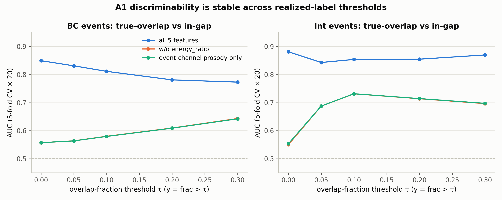

# A2：连续化敏感性检验——A1 结论的稳健性与细化

> **日期**：2026-08-25
> **动机**：[A1](2026-08-25_ari_a1_within_class.md) 的类内判别依赖特定 realized 裁决阈值
> （0.1×声道最大 RMS、0.1-0.5s 跨度规则）。A2 用连续量 `both_active_frac`
> （事件窗口内双声道同时活跃帧占比）检验两个问题：① 韵律特征与重叠程度的连续相关性；
> ② A1 的 AUC 是否随 realized 阈值（y = frac > τ）变化。
>
> **脚本**：`pilot_study/scripts/ari_analyze_a2.py`；结果 `real_data/results/analysis/ari/a2_results.json`

---

## 1. 数据概况

| 事件类型 | n | frac 均值 | frac>0 占比 |
|---|---|---|---|
| BC | 32,848 | 0.148 | 57.7% |
| Int | 10,404 | 0.086 | 96.7% |

注：Int 事件几乎全部（96.7%）至少有少量双活跃帧——与 verify_backchannel 的
"BC/Int 有短暂真实重叠"一致；但 frac 均值仅 0.09，即重叠只占事件窗口的一小部分
（~0.6s 重叠 / ~3.7s 话轮）。BC 有 42% 的事件完全无重叠（渲染进停顿）。

## 2. 连续相关性（Spearman r，bootstrap 95% CI）

| 特征 | BC | Int |
|---|---|---|
| energy_ratio | **−0.476** | **−0.588** |
| f0_correlation | −0.001 | −0.005 |
| f0_slope | +0.013 | −0.173 |
| spectral_centroid | −0.092 | −0.034 |
| voiced_ratio | +0.144 | **+0.374** |
| dur（描述性） | +0.168 | **−0.671** |

- energy_ratio 与 frac 的中等负相关是构造性的（同一物理量的两个函数），作为参照。
- **事件自身韵律特征与重叠程度的连续相关均弱**（BC：|r|≤0.14；Int：voiced_ratio 0.37、
  f0_slope −0.17 为中等偏弱）。
- Int 的 dur 与 frac 强负相关（−0.67）主要是**机械效应**：重叠时长有界（~0.6s），
  话轮越长 frac 越低——不是渲染行为的证据。

## 3. 阈值敏感性（AUC vs τ；重复分层 5 折 CV × 20 种子）

| τ | BC 全特征 | BC 无能量比 | BC 仅韵律 | Int 全特征 | Int 无能量比 | Int 仅韵律 |
|---|---|---|---|---|---|---|
| 0.00 | 0.850 | 0.557 | 0.557 | 0.881 | 0.550 | 0.554 |
| 0.05 | 0.831 | 0.564 | 0.564 | 0.843 | 0.688 | 0.688 |
| 0.10 | 0.812 | 0.580 | 0.579 | 0.854 | 0.732 | 0.732 |
| 0.20 | 0.781 | 0.609 | 0.609 | 0.855 | 0.714 | 0.714 |
| 0.30 | 0.773 | 0.643 | 0.642 | 0.870 | 0.697 | 0.698 |



（"无能量比"与"仅韵律"两条曲线几乎重合 → f0_correlation 在类内判别中同样无贡献，
与 A1 一致。τ=0 的 Int 点受严重类别不平衡影响，参考性弱：96.7% 为正类。）

## 4. 裁决

1. **A1 主结论稳健**：在标准裁决口径（"是否存在任何真实重叠"，对应低 τ）下，
   事件自身韵律特征的可分性 ≈ 随机（0.55-0.58）。**"重叠与否在 token 韵律上无迹可循"
   不依赖裁决阈值的细节**。
2. **新的梯度发现**：当阈值收紧到"实质重叠"（τ ≥ 0.1-0.3，即窗口内 >10-30% 时间
   双声道同时活跃）时，韵律特征的可分性**单调上升**（BC 0.58→0.64；Int 0.55→0.73）。
   即：短暂的 ~0.6s 重叠（合成数据的典型情况）在 token 自身韵律上几乎没有印记；
   **较长的实质重叠才会留下韵律印记**（Int 侧主要来自 voiced_ratio/f0_slope 的差异，
   方向符合"与宿主争抢发言权时更持续发声/更平直"的解释，但属事后归因，需谨慎）。
3. 综合 A1+A2 的精确表述：**渲染引擎的典型重叠事件（短暂、无韵律印记）对特征/模型
   而言与"停顿内的同形 token"不可区分；只有少见的实质重叠才在韵律上可查。**
   这比 A1 的单点结论更精确，也为"神不似"提供了限定：不是"完全无迹可循"，
   而是"典型渲染量级下无迹可循"。

## 5. 局限

- τ=0 的 Int 点类别严重不平衡（正类 96.7%），AUC 估计噪声大。
- voiced_ratio/f0_slope 在高 τ 下的可分性可能部分源于事件内部停顿结构差异
  （连续发声的话轮更可能压过宿主尾音），非渲染器主动的韵律设计。
- frac 与特征来自同一窗口，能量比之外的特征与 frac 的弱相关不能排除间接耦合
  （如宿主语音对 token 的掩蔽改变质心）。

## 6. 复现

```bash
srun --jobid=<kimi作业号> --overlap bash -c \
  'cd /share/workspace3/zhuangruicen/proj-thumpy/pilot_study && \
   /share/home/zhuangruicen/miniconda3/envs/fd_analysis/bin/python scripts/ari_analyze_a2.py'
```
