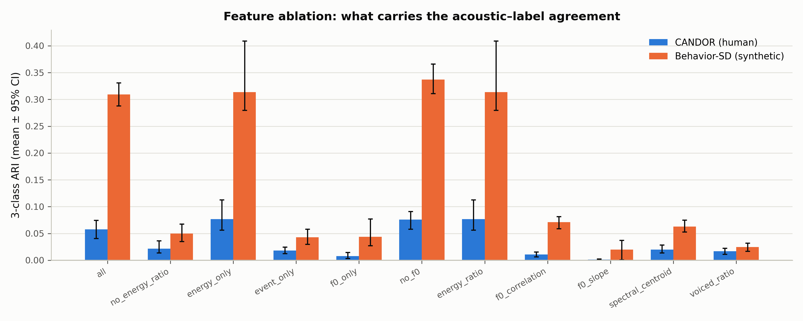

# B：特征归因与消融——"声学-语义一致性差距"到底由什么承载

> **日期**：2026-08-25
> **动机**：[主实验](2026-08-23_ari_results.md) 的 ΔARI=−0.25 是 5 个特征共同作用的结果，
> 但 §3.2 的特征均值表已提示 log10 能量比是主导项。B 通过逐组消融量化各特征的贡献，
> 检验"None 类静音捷径"假设。
>
> **脚本**：`pilot_study/scripts/ari_analyze_b.py`；结果 `real_data/results/analysis/ari/b_results.json`

---

## 1. 设计

11 个特征组（6 组 + 5 单特征），每组在 CANDOR 与 Behavior-SD 上重跑
会话/文件级 bootstrap（B=200，N=1000/类，K=3，与主实验同口径）：

| 组 | 特征 |
|---|---|
| all | 5 特征全量（主实验口径） |
| no_energy_ratio | 去 log10 能量比 |
| energy_only | 仅能量比 |
| event_only | 仅事件声道韵律（f0_slope, spectral_centroid, voiced_ratio） |
| f0_only | 仅 F0 组（f0_correlation, f0_slope） |
| no_f0 | 去 F0 组 |
| energy_ratio / f0_correlation / f0_slope / spectral_centroid / voiced_ratio | 单特征 |

## 2. 结果（三分类 ARI，均值 [95% CI]）

| 特征组 | CANDOR | Behavior-SD | Δ |
|---|---|---|---|
| all | 0.058 [0.041, 0.075] | 0.309 [0.288, 0.331] | **−0.251** |
| **no_energy_ratio** | 0.022 [0.014, 0.036] | **0.050 [0.035, 0.068]** | −0.028 |
| **energy_only** | 0.077 [0.056, 0.113] | **0.314 [0.280, 0.409]** | −0.237 |
| event_only | 0.018 [0.012, 0.025] | 0.043 [0.030, 0.058] | −0.025 |
| f0_only | 0.008 [0.003, 0.015] | 0.044 [0.027, 0.077] | −0.036 |
| no_f0 | 0.076 [0.058, 0.091] | 0.337 [0.311, 0.366] | −0.261 |
| energy_ratio | 0.077 [0.056, 0.113] | 0.314 [0.280, 0.409] | −0.237 |
| f0_correlation | 0.011 [0.006, 0.016] | 0.071 [0.059, 0.082] | −0.060 |
| f0_slope | 0.001 [0.000, 0.003] | 0.020 [0.001, 0.037] | −0.018 |
| spectral_centroid | 0.020 [0.014, 0.029] | 0.063 [0.053, 0.075] | −0.043 |
| voiced_ratio | 0.017 [0.011, 0.022] | 0.025 [0.017, 0.032] | −0.008 |



## 3. 裁决

1. **差距几乎全部由 log10 能量比承载**：energy_only (0.314) ≈ all (0.309)；
   去掉能量比后 Behavior-SD 从 0.309 **坍缩到 0.050**（接近随机），Δ 从 −0.251 缩到 −0.028。
   主实验的"声学-语义一致性差距"，具体化之后就是**"对方声道是否静音"这一条线索的差距**。
2. **其余所有特征（含全部韵律特征）在两数据集上都接近随机**：event_only 0.043/0.018、
   f0_only 0.044/0.008、单特征 0.001-0.077。**本特征集里不存在可用的 BC/Int 韵律签名**——
   这与 A1/A2 的发现自洽：合成数据的韵律特征本就不编码交互属性，人类数据的韵律线索
   又被串扰/标签噪声淹没。
3. 两个细节：CANDOR 的 energy_only (0.077) **高于** all (0.058)——F0 类特征对人类数据
   聚类是纯噪声；Behavior-SD 的 no_f0 (0.337) 也略高于 all (0.309)——F0 特征对合成数据
   同样只有噪声贡献。
4. **对 benchmark 论文的实质意义**：在 Behavior-SD 上，"BC/Int/None 的声学区分"约等于
   "听对方声道有没有声音"（静音捷径），且该捷径在真实录音（CANDOR：能量比 ARI 仅 0.077）
   上几乎不可用。任何在 Behavior-SD 上评测的模型分数都应以"无能量比特征/跨数据集迁移"
   作为下界对照（见计划中的 C 实验）。

## 4. 局限

- 消融是"整体替换"式的（同一组内 bootstrap 独立抽样），未做配对；
  且聚类（KMeans）对特征尺度敏感，不同组间 ARI 的绝对值比较应主要看趋势。
- 能量比的贡献中有一部分与标签定义构造性相关（Int/None 定义即与重叠有关），
  这是主实验已知的固有限制，消融不改变该限制。
- 未消融"声道分离质量"本身（即把 Behavior-SD 的声道人为混合后重测）——可作为 C 的补充。

## 5. 复现

```bash
srun --jobid=<kimi作业号> --overlap bash -c \
  'cd /share/workspace3/zhuangruicen/proj-thumpy/pilot_study && \
   /share/home/zhuangruicen/miniconda3/envs/fd_analysis/bin/python \
   scripts/ari_analyze_b.py --b 200 --n3 1000'
```
