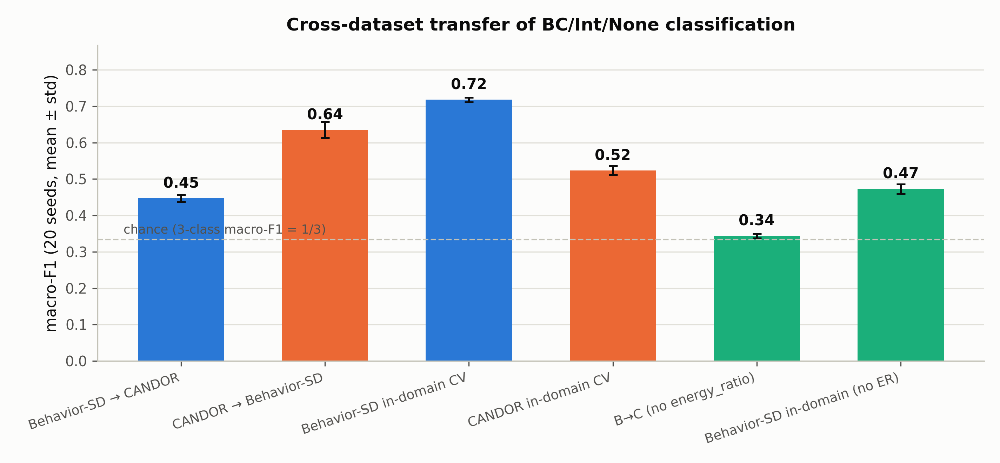

# C：跨数据集迁移——"静音捷径"在真实录音上是否失效

> **日期**：2026-08-25
> **动机**：[B 消融](2026-08-25_ari_b_ablation.md) 证明 Behavior-SD 的标签-声学一致性
> 几乎全部由"对方声道是否静音"（log10 能量比）承载。C 检验该捷径的可迁移性：
> 在合成数据上学到的判别边界，零样本应用到真实录音（CANDOR）后还剩多少？
>
> **脚本**：`pilot_study/scripts/ari_analyze_c.py`；结果 `real_data/results/analysis/ari/c_results.json`

---

## 1. 设计

- 分类器：LogisticRegression；StandardScaler 在**训练集**上拟合后应用于测试集
- 任务：三分类 BC/Int/None（macro-F1；随机水平 = 1/3）
- 方向与参照：
  - B→C：Behavior-SD 训练 → CANDOR 零样本（主）
  - C→B：反向对照
  - B in-domain / C in-domain：同域分层 5 折 CV（参照上界）
  - 各方向再跑"无 energy_ratio"版本（检验捷径在迁移中的作用）
- 每种子：源域平衡抽样 N=1000/类训练，目标域平衡抽样 N=1000/类测试；20 种子

## 2. 结果（macro-F1，均值 ± std）

| 配置 | macro-F1 |
|---|---|
| **Behavior-SD → CANDOR** | **0.447 ± 0.009** |
| CANDOR → Behavior-SD | **0.636 ± 0.022** |
| Behavior-SD in-domain CV | 0.718 ± 0.006 |
| CANDOR in-domain CV | 0.524 ± 0.012 |
| B→C（无 energy_ratio） | **0.344 ± 0.006**（≈ 随机 0.333） |
| Behavior-SD in-domain（无 energy_ratio） | 0.473 ± 0.013 |



## 3. 裁决

1. **捷径部分迁移、大幅退化**：B→C 从域内 0.718 跌到 0.447（仍高于随机 0.333）。
   "对方声道静音"在真实录音上依然有信息（毕竟真实重叠时对方声道确实更响），
   但被串扰/背景声模糊后，判别边界不再锐利——这正是"合成数据捷径不完整迁移"的定量证据。
2. **去掉能量比后迁移归零**：B→C 无能量比 = 0.344 ≈ 随机。韵律特征在合成数据上
   学不到任何可迁移的判别信息（与 B 消融、A1/A2 自洽）。
3. **反向迁移更强（0.636 > 正向 0.447，且 > CANDOR 域内 0.524）**——最有意思的发现：
   在**嘈杂人类数据**上学到的分类器，用在**干净合成数据**上反而比自己域内还高。
   解释：CANDOR 的标签带噪（ASR 派生），其域内 CV 上界（0.524）是**标签噪声受限**的；
   同一个分类器面对 Behavior-SD 的干净标签时，暴露出的真实判别力是 0.636。
   同时说明人类数据学到的边界更"稳健"（不依赖锐利的静音阈值），合成数据学到的边界
   更"脆"（0.718 → 0.447 的大幅退化）。
4. **对 benchmark 论文的三层含义**：
   - 在 Behavior-SD 上评测的模型分数中，0.72→0.47 的部分是捷径贡献（无能量比对照）；
   - 跨数据集迁移是捷径问题的直接度量：B→C 的 0.45 与 B 域内 0.72 的差距 =
     合成数据评测分数在真实分布上的期望折扣；
   - CANDOR 侧的低 ARI/F1 主要受标签噪声限制（C→B 0.636 提示），为 D 实验提供了
     直接动机：人类基线的真实上限比 0.06/0.52 更高。

## 4. 局限

- LogisticRegression 线性边界是最简设定；非线性模型可能学出更复杂（也更不可解释）的
  捷径形态，但"无能量比归零"的结论对模型族大概率稳健。
- 零样本迁移未做特征分布适配（如 CORAL/标准化对齐）——若对齐后 B→C 显著回升，
  则"差距主要是分布偏移"而非"标签语义不一致"；可作为后续消融。
- 训练/测试各 N=1000/类为设定值；CANDOR 测试集的标签本身有噪声（低估 B→C 的真实能力）。

## 5. 复现

```bash
srun --jobid=<kimi作业号> --overlap bash -c \
  'cd /share/workspace3/zhuangruicen/proj-thumpy/pilot_study && \
   /share/home/zhuangruicen/miniconda3/envs/fd_analysis/bin/python scripts/ari_analyze_c.py'
```
