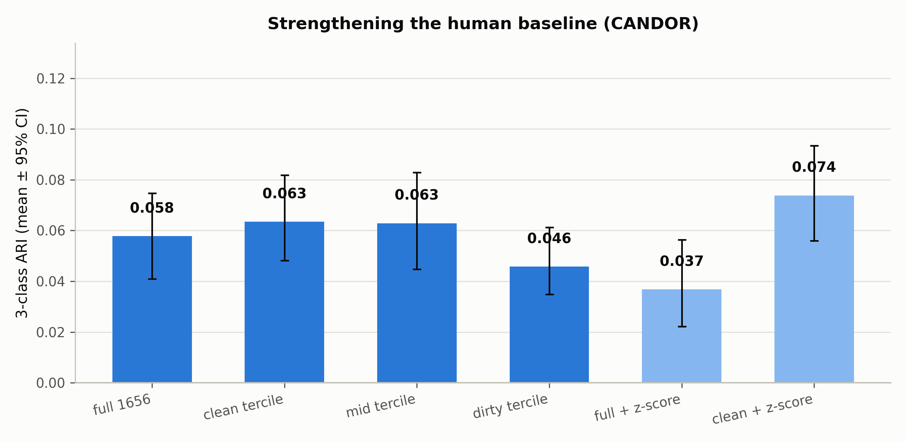

# D：强化人类基线——CANDOR 的低 ARI 能被"清洗"修复吗

> **日期**：2026-08-25
> **动机**：[C 迁移](2026-08-25_ari_c_transfer.md) 发现 CANDOR 训练的分类器在
> Behavior-SD 上达 0.636 F1、高于自身域内 0.524，提示 CANDOR 的低表现受标签噪声限制。
> D 直接检验另一面：把人类基线的数据质量（串扰）与说话人因素（z-score）修好后，
> 无监督聚类 ARI 能否从 0.058 明显回升？这决定主实验 ΔARI 的解读是否稳健。
>
> **脚本**：`pilot_study/scripts/ari_analyze_d.py`；结果 `real_data/results/analysis/ari/d_results.json`

---

## 1. 设计

- **串扰分层**：会话级串扰指标 = 该会话 None 事件（无重叠 turn）的 log10 能量比中位数
  —— 无重叠时对方声道仍有的能量 ≈ 串扰/背景。按三分位把 1656 会话分为
  干净/中等/嘈杂三档（各 ~550 会话），分别重算三分类 ARI（B=200，N=1000/类）。
- **per-session z-score**：特征按会话内标准化（去说话人/响度/设备差异）后重算。
- **组合**：干净档 + z-score。
- **BC-vs-Int** 二分类 ARI 作为"人类 BC/Int 可分性上限"的参照。

## 2. 结果

| 变体 | 三分类 ARI（均值 [95% CI]） |
|---|---|
| 全量 1656 会话（主实验口径） | 0.058 [0.041, 0.075] |
| 干净档（547 会话） | 0.063 [0.048, 0.082] |
| 中等档（562 会话） | 0.063 [0.045, 0.083] |
| 嘈杂档（547 会话） | 0.046 [0.035, 0.061] |
| 全量 + per-session z-score | 0.037 [0.022, 0.056] |
| **干净档 + z-score（最强变体）** | **0.074 [0.056, 0.093]** |

BC-vs-Int 二分类 ARI：全量 0.030 [0.019, 0.044]；干净档 0.031 [0.018, 0.045] —— 无改善。



## 3. 裁决

1. **人类基线几乎不可修复**：最强变体（干净档+z-score）也只有 0.074，与全量 0.058 的
   CI 重叠；BC-vs-Int 完全不动（0.030→0.031）。**用这套 5 特征做无监督聚类，
   人类 BC/Int/None 的 ARI 上限约在 0.07 附近**——这不是数据清洗能解决的问题。
2. **串扰有方向性但非主因**：干净档 0.063 vs 嘈杂档 0.046（方向一致、幅度小）。
3. **z-score 对全量有害**（0.058→0.037）：会话间能量比尺度的差异本身携带类别信息
   （去掉后 KMeans 失去部分可分性）；只在干净档上组合 z-score 才略有增益。
4. **与 C 结果的对账**：C 显示"监督学习+干净标签"可达 0.636（C→B），D 显示
   "无监督聚类+清洗"只能到 0.074。两者不矛盾：监督 ERM 能平均掉标签噪声、
   在干净标签上兑现中等判别力；但特征空间的**无监督结构**本身很弱——
   人类 BC/Int/None 在这 5 个特征上没有清晰的簇结构。
5. **对主实验的意义**：ΔARI=−0.25 的解读因此更稳——差距不是"人类基线没洗干净"的
   人为压低（清洗后差距反而从 −0.25 变为 −0.31−0.07 ≈ −0.24，几乎不变），
   而是两个数据集在这套特征上的结构差异：合成数据有平凡可分的静音捷径（B 已证），
   人类数据无任何可用的无监督结构。

## 4. 局限

- 串扰指标只用了 None 事件的能量比中位数；更强的清洗（如按语音活动检测过滤会话片段）
  可能进一步改善，但方向性结论大概率不变。
- z-score 为会话级；说话人级 z-score 需要 speaker 标注（CANDOR 有 user_id，未用）。
- 未尝试更大特征集（如 MFCC 统计量、发音速率）——"特征不足"的结论限定于本实验的
  5 个文献特征。

## 5. 复现

```bash
srun --jobid=<kimi作业号> --overlap bash -c \
  'cd /share/workspace3/zhuangruicen/proj-thumpy/pilot_study && \
   /share/home/zhuangruicen/miniconda3/envs/fd_analysis/bin/python \
   scripts/ari_analyze_d.py --b 200'
```
