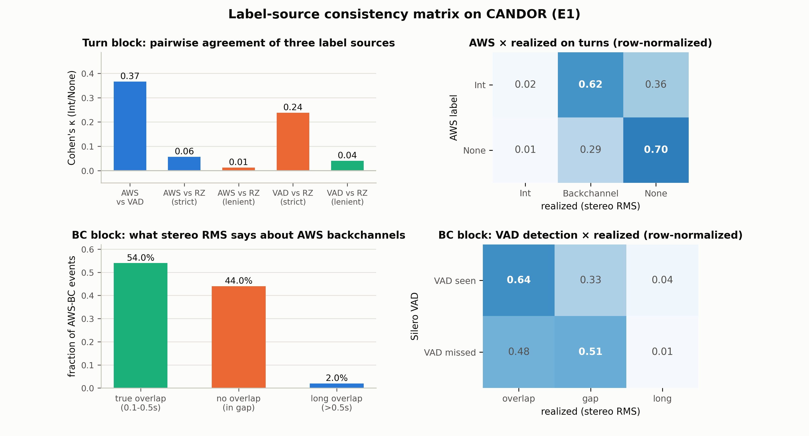

# E1：标签源一致性矩阵——同一批事件，三种工具链，三种裁决

> **日期**：2026-08-25
> **动机**：[论文故事](2026-08-25_paper_story.md) 的 Act 2 前置实验：基准评测指标
> 依赖的标签层级（L2 声学派生）在真实音频上到底有多不一致？E1 在 CANDOR 的
> **同一批事件**上并行运行三种标签工具链，量化两两一致性。
>
> **脚本**：`pilot_study/scripts/ari_e1_extract.py`（提取）+ `ari_e1_analyze.py`（分析）
> 结果 `real_data/results/analysis/ari/e1_results.json`

---

## 1. 三套标签

对主实验的 204k CANDOR 事件（全部在事件窗口上计算，seek-read 无需全量解码）：

| 标签源 | 工具 | 规则 |
|---|---|---|
| **AWS** | 已有 backbiter/audiophile 标签 | BC 窗口；Int = overlap 标志 & dur>0.3；None = 无重叠 & dur>0.5 |
| **VAD** | Silero VAD（与 FD-Bench 同款工具、同阈值 0.5） | turn 起始 0.2s 内对方声道有 VAD 语音 → Int；BC 窗口内事件声道语音占比 ≥0.5 → 检出 |
| **realized** | 声道级 RMS 双活跃段（绝对阈值 0.01） | >0.5s → Int；0.1-0.5s → Backchannel；无 → None |

## 2. 结果

### 2.1 turn 块（98,078 个 Int/None 事件）两两 Cohen's κ

| 对比 | κ | 解读 |
|---|---|---|
| AWS vs VAD | **0.366** | 两个"声学工具链"间只是中等一致——它们本应测同一件事 |
| AWS vs realized（严格） | **0.057** | ASR 派生的 Int/None 与"真实同时发声"几乎无关 |
| VAD vs realized（严格） | **0.238** | VAD 与真实重叠的关联明显好于 AWS |
| AWS/VAD vs realized（宽松，BC→None） | 0.013 / 0.040 | 把短暂重叠归入 None 后一致性崩塌——阈值映射本身主导结果 |

### 2.2 AWS × realized 交叉表（行归一）

| AWS 标签 | realized=Int（>0.5s） | realized=Backchannel（0.1-0.5s） | realized=None（无重叠） |
|---|---|---|---|
| Int | 0.02 | **0.62** | 0.36 |
| None | 0.01 | **0.29** | 0.70 |

**标签空间坍塌被量化**：62% 的 AWS-Int 只有短暂重叠（0.1-0.5s），36% 完全没有重叠；
29% 的 AWS-None 实际有短暂双活跃段。AWS 的 Int/None 分界线从真实声学结构中横切而过。

### 2.3 BC 块（106,376 个 AWS backchannel）

- **Silero VAD 只"看到" 37.1%** 的 AWS backchannel（62.9% 的 BC 窗口内无可检测语音
  ≥50% 占比——BC 太短/太轻，低于 VAD 检测下限）。
- **只有 44.5% 的 BC 发生在宿主说话期间**（host_active）——过半 AWS backchannel
  标注在宿主停顿里，与主实验"BC 常落在宿主停顿"的观察一致。
- realized 分布：54.0% 有短暂真实重叠、44.0% 无重叠、2.0% 长重叠。
- VAD 检出的 BC 中 66% 有真实重叠；VAD 漏检的 BC 中仍有 52% 有真实重叠
  （RMS 阈值 0.01 比 VAD 阈值 0.5 更敏感）。



## 3. 裁决（对论文故事的意义）

1. **L2 标签源之间的不一致是数量级的**：κ(AWS,VAD)=0.37、κ(AWS,realized)=0.06、
   κ(VAD,realized)=0.24。这意味着**"评测用的标签"本身就是个自由度**——换一个
   声学工具链，同一批事件的 Int/None 标签有 1/3 以上的事件会翻转。
2. **FD-Bench 式指标的直接后果（为 E2 铺路）**：FD-Bench 的 SIR/EIR/NIR 全部建立在
   VAD 时间戳区间规则上。在真实音频上，这套规则与"真实重叠"（realized）的一致性
   上限就是本表的 0.24（严格）——即**其打断指标在真实分布上的标签噪声地板**。
3. **AWS 标签（我们主实验用的 CANDOR 真值）被确认为最弱的一档**：与真实重叠几乎无关
   （0.057）。这为主实验的"人类基线低"提供了直接解释，也为 E4（插件标注器）设置了
   明确的超越目标：插件标签与 realized 的 κ 若能显著超过 0.24（VAD 的水平），
   就证明了模型化标注器的价值。
4. **BC 标注的双重噪声**：位置噪声（55% 不在宿主说话期间）+ 检测噪声（63% 低于
   VAD 阈值）。任何在真实音频上做 backchannel 评测的 pipeline 都会继承这两重噪声。

## 4. 局限

- realized 用绝对 RMS 阈值（0.01）而非 per-file 最大值（Behavior-SD 的口径），
  两口径对 CANDOR 的敏感性未做交叉验证；严格/宽松两种映射都报告了，结论不依赖单一映射。
- VAD 规则复刻了 FD-Bench 的"起始重叠"逻辑但阈值（0.2s 判定窗）是自设的；
  E2 会用 FD-Bench 原始阈值（0.5s/2.5s）做完整复刻。
- Silero VAD 在 64kbps MP3 + 串扰上的检出率本身有限（BC 块 37%），
  VAD 侧的数字应理解为"该工具链在此音频质量下的表现"。

## 5. 复现

```bash
# 提取 (8 workers, 断点续跑)
for w in 0 1 2 3 4 5 6 7; do
  python scripts/ari_e1_extract.py --worker $w --n-workers 8 \
      --out real_data/results/analysis/ari/candor_e1_w$w.csv &
done; wait
# 分析
python scripts/ari_e1_analyze.py
```
