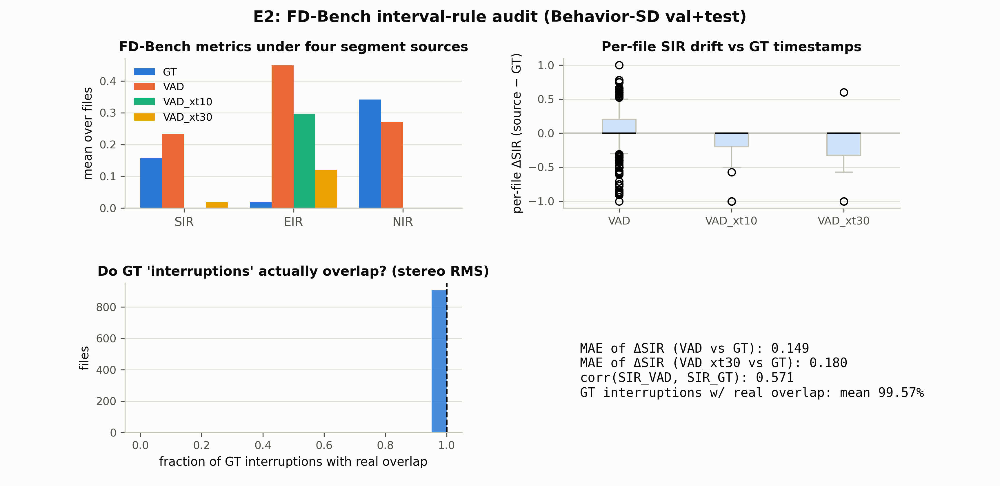

# E2：FD-Bench 指标审计——区间规则的标签源敏感性与串扰压力测试

> **日期**：2026-08-25
> **动机**：[论文故事](2026-08-25_paper_story.md) Act 2 的核心实验：FD-Bench 的
> SIR/EIR/NIR 建立在 VAD 时间戳区间规则上。E2 回答两个问题：① 同样的规则，
> 片段来源从"完美 GT"换成"VAD"后指标值漂移多大？② 规则赖以成立的"独立干净流"
> 假设在串扰下有多脆弱？
>
> **脚本**：`pilot_study/scripts/ari_e2_extract.py` + `ari_e2_analyze.py`
> 结果 `real_data/results/analysis/ari/e2_results.json`
> **数据**：Behavior-SD validation+test 全量（1,857 文件）
> **规则复刻**：FD-Bench `benchmarking.py` L597-851 的忠实简化（16k 样本常量：
> 用户打断 = AI 段中途开口；成功 = AI 在用户说完前停；错误打断 = AI 抢话且用户
> 剩余 >0.5s；噪声打断 = 轮间空隙 ≥2.5s 且 AI 段 <5.5s；VAD 参数同 FD-Bench：
> threshold 0.5、min_silence 1500ms）。

---

## 1. 结果

### 1.1 四种片段来源下的指标均值（1,857 文件）

| 片段来源 | n_round 均值 | SIR | EIR | NIR |
|---|---|---|---|---|
| **GT（metadata 时间戳）** | 7.7 | **0.157** | **0.018** | **0.342** |
| VAD（干净声道） | 6.5 | 0.233 | **0.449** | 0.271 |
| VAD + 10% 串扰 | **1.0** | 0.000 | 0.297 | 0.000 |
| VAD + 30% 串扰 | **1.0** | 0.019 | 0.121 | 0.000 |

### 1.2 逐文件漂移（vs GT）

| 指标 | MAE(VAD) | 均值漂移 | corr(VAD, GT) |
|---|---|---|---|
| SIR | 0.149 | +0.076 | 0.571 |
| EIR | **0.433** | **+0.431** | **0.167** |
| NIR | 0.378 | −0.071 | −0.130 |

（串扰 10% 时 SIR/NIR 对几乎所有文件坍缩为 0，相关性无定义。）

### 1.3 GT"打断"事件的真实重叠率

916 个含打断事件的文件中，GT 判定的"用户打断 AI"事件里 **99.6%（中位数 100%）**
在 [打断起点, +0.5s] 内确有双声道同时活跃——合成数据的 metadata 时间戳本身是
"真"的（打断了就是真打断了）。渲染层的问题在别处（BC 位置/时长，见主报告与 A1），
不影响本实验。



## 2. 裁决

1. **指标值严重依赖片段来源**：EIR 从 GT 的 0.018 变成 VAD 的 0.449——**25 倍**，
   且逐文件相关性仅 0.17（几乎无信息）。SIR 漂移 0.15 且相关 0.57。NIR 相关为负。
   即：**同一批对话、同一套规则，换成"FD-Bench 自己使用的 VAD 流程"后，
   报告的 EIR/SIR 数值会发生质变**——基准报告里的这些数字，测的到底是模型行为
   还是 VAD 的切分行为，从数据上无法区分。
2. **"独立干净流"假设是承重墙**：仅 10% 声道串扰就让 VAD 的 n_round 从 6.5 坍缩到
   1.0（min_silence 1500ms 把两条串扰流合并成一条），SIR/NIR 直接归零——
   指标集完全退化。而真实录音的串扰水平远高于此（CANDOR 的 None 事件对方声道
   能量比 1.42，见主报告 §3.2）。**FD-Bench 式指标在真实混合录音上不可计算**。
3. **与 E1 合流**：E1 给出标签源在事件级的一致性（κ 0.37/0.06/0.24），E2 给出
   标签源在**指标级**的敏感性（EIR 25 倍、corr 0.17）。两层合起来就是 Act 2 的
   核心证据：**"声学派生标签 + 区间规则"的评测管线，其报告值由工具链选择决定，
   不由模型行为决定**。
4. **对"无捷径对照协议"的启示**：任何基于 VAD 时间戳的 turn-taking 指标，至少应
   附带 (a) 片段来源敏感性（换 VAD 参数/换工具链后指标漂移量）；(b) 串扰压力测试
   （10%/30% 声道泄漏下的退化曲线）。本实验就是这两个对照的现成模板。

## 3. 局限

- 规则为"忠实简化"：FD-Bench 原始代码的 AI 段-用户轮配对逻辑未逐行复刻
  （如 Moshi preamble 跳过、首段处理），绝对数值不应与官方结果直接对比；
  本实验的结论基于**同一套规则在不同片段来源间的相对漂移**，对配对细节稳健。
- VAD 参数固定为 FD-Bench 默认（0.5/1500ms）；参数敏感性未测（可作为对照协议的
  第二维度）。
- 串扰为线性加性模型（A+αB），真实串扰含延迟/滤波/非线性，本实验是下界估计。

## 4. 复现

```bash
# 提取 (8 workers)
for w in 0 1 2 3 4 5 6 7; do
  python scripts/ari_e2_extract.py --worker $w --n-workers 8 \
      --out real_data/results/analysis/ari/e2_rows_w$w.csv &
done; wait
# 分析
python scripts/ari_e2_analyze.py
```
