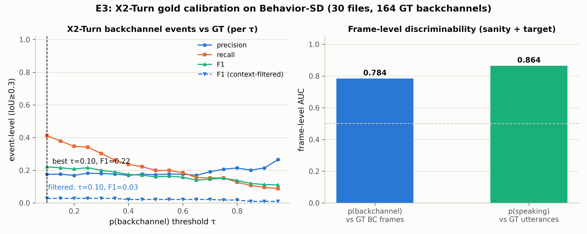

# E3：X2-Turn 金标准校准——模型化标注器的标签空间错配

> **日期**：2026-08-25
> **动机**：[论文故事](2026-08-25_paper_story.md) Act 3 的第一步：用 Behavior-SD 的完美
> GT 校准 X2-Turn，看它作为"模型化标注器"在合成数据上的 backchannel 检出质量。
> **结果出乎意料但信息量大**：校准暴露的是**标签空间错配**，而非单纯的检测能力不足。
>
> **脚本**：`pilot_study/scripts/ari_e3_calibrate.py`（x2-turn 环境，按声道推理）
> + `ari_e3_analyze.py`；原始推理产物 `real_data/results/annotator/e3_raw/`
> **数据**：Behavior-SD validation 前 30 文件，60 条声道流，164 个 GT backchannel 窗口

---

## 1. 方法

- 每个文件：ffmpeg pan 滤镜拆双声道（16k mono）→ `infer_asr_turn` 逐声道推理
  → 80ms/帧的 6 类状态 + p(backchannel)/p(speaking) 概率
- GT：metadata 嵌套 backchannels（听者声道）与 utterances
- 帧级：p_bc 对"帧落在 GT BC 窗口内"的 AUC；p_speak 对 GT utterance 的 AUC（管线合理性）
- 事件级：p_bc≥τ 的连续帧段 → 事件，匹配 = 预测 ≥50% 时长落在 GT 窗口内
  （不用 IoU——GT 窗口 ~0.6s 远长于模型的短暂触发）
- 上下文过滤变体：事件期间对方声道 ≥50% 帧在 speaking（模拟"BC 须发生在宿主说话时"）
- 经验滞后估计：p_speak 与 GT utterance 互相关 → −1 帧（−80ms）——**模型帧时间轴
  无系统性滞后**（冒烟中开头 0.5s idle 是模型把 "Hey, uh," 犹豫段判为无语义内容）

## 2. 结果

| 指标 | 值 |
|---|---|
| p_bc 帧级 AUC | **0.784** |
| p_speak 帧级 AUC（合理性） | **0.864** |
| 事件级 best F1（τ=0.1，原始） | **0.221**（P=0.176 / R=0.412） |
| 窗口检出率（τ=0.1） | 41.5% |
| 事件级 best F1（上下文过滤） | **0.028**（过滤反而毁掉） |

**误报位置诊断**（τ=0.1，605 个预测事件）：

| 位置 | 占比 | 解读 |
|---|---|---|
| 自己声道 GT utterance 内 | **64%** | 说话人自己话轮内的简短附和 token（"yeah, so..."） |
| 对方声道 utterance 内 | 12% | 语义上可能是真 BC（含停顿内 BC） |
| GT BC 窗口内 | 12% | 命中 |
| 空隙中 | 12% | 纯误报 |



## 3. 裁决

1. **软信号存在，硬对齐弱**：p_bc 帧级 AUC 0.78（概率对 GT BC 区域有判别力），
   但事件级 F1 仅 0.22。X2-Turn 的 backchannel 状态**知道** BC 是什么，
   但它的"backchannel"是**语言学的（任何简短附和 token）**，而 Behavior-SD 的
   metadata BC 是**跨说话人的（听者对宿主）**——64% 的模型触发落在说话人自己的
   话轮内，在 metadata 语义下全是"误报"，在语言学语义下大多成立。
2. **上下文过滤反向验证了渲染缺口**：强制"BC 须发生在宿主说话时"（本应是合理的
   先验）让 F1 崩到 0.03——因为 Behavior-SD 有 44-54% 的 BC 渲染在宿主停顿里
   （A1/E1 的结论）。模型在停顿里正确检出 token，过滤把它杀掉了。
   即：**模型与渲染现实一致，与 metadata 语义不一致**。
3. **对论文故事的修正**：Act 3 的"合成 GT 校准标注器"多了一个前提——**标签空间映射**
   是校准的一部分，不是校准后的应用细节。E4（应用到 CANDOR）时，X2-Turn 的
   "语言学 BC"标签与 AWS 的"跨说话人 BC 事件"标签不可直接比较，必须：
   (a) 用帧级概率而非硬标签；(b) 报告"窗口检出率/覆盖率"而非事件 F1 作为主指标；
   (c) 明确比较对象是"any-token 检出"还是"event 检出"。
4. **E1 基准的适用性**：E1 设的"κ vs realized > 0.24"目标仍成立，但要在
   **同一标签空间语义**下比较——E4 将用"帧级 p_bc vs 声道 RMS 双活跃"这种
   语义一致的口径。

## 4. 局限

- 30 文件子集（164 个 BC 窗口）——校准曲线的置信区间未报告，趋势可信、绝对数有波动。
- 未尝试 τ 以外的后处理（最小触发时长、帧合并半径的敏感性）。
- 模型在 TTS 音频上的表现可能系统性地低于真实语音（训练域外），E4 在 CANDOR
  上可能不同——这正是 E4 要回答的问题。

## 5. 复现

```bash
# 推理 (gpu02, x2-turn 环境, 单卡)
python scripts/ari_e3_calibrate.py --n-files 30
# 分析 (fd_analysis 环境)
python scripts/ari_e3_analyze.py
```
