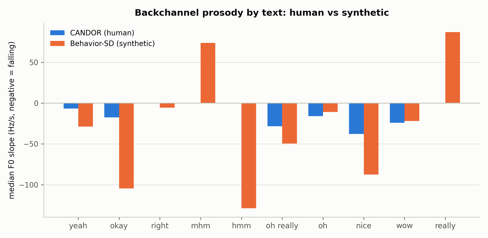

# E：合成 BC 韵律缺陷验证——文本与实测 F0 斜率的对照

> **日期**：2026-08-25
> **动机**：[主报告](2026-08-23_ari_results.md) §3.2 称"合成 BC 音高下降弱于人类
> （均值 −14 vs −61 Hz/s）"。E 用文本对齐验证该表述，结果**部分推翻**：均值比较
> 被偏态分布误导，真实的韵律差异更微妙、更有信息量。
>
> **脚本**：`pilot_study/scripts/ari_analyze_e.py`；结果 `real_data/results/analysis/ari/e_results.json`

---

## 1. 设计与数据

- BC 事件与文本对齐：Behavior-SD 用元数据嵌套 backchannels 的 `tts_text`
  （按 file_id + 起始时间 ±0.02s 匹配，31,234/32,848 成功）；CANDOR 用 backbiter 的
  `backchannel` 列（106,376 全部匹配）。
- 指标：每个文本的 f0_slope（Hz/s）中位数；总体中位数与平坦/降调/升调占比
  （平坦 |slope|<20，降调 <−20，升调 >+20）。
- 相同文本取两数据集均有且 n≥30 的前 10 个。

## 2. 结果

### 2.1 总体（BC 全部事件）

| | n | 中位斜率 | 平坦% | 降调% | 升调% |
|---|---|---|---|---|---|
| CANDOR（人类） | 106,376 | **−7.7** | 23.1% | 46.5% | 30.5% |
| Behavior-SD（合成） | 31,234 | **−29.2** | 10.8% | 52.5% | 36.6% |

（对照：主报告 §3.2 的**均值**为 CANDOR −61.2 / Behavior-SD −13.8——人类侧均值被
少数强降调事件拉低，中位数揭示大多数人类 BC 是平的；合成侧均值被升调事件抬高。）

### 2.2 相同文本的中位斜率

| 文本 | CANDOR | Behavior-SD | 语义应为 |
|---|---|---|---|
| yeah | −6.6 | −28.8 | 降 |
| okay | −17.5 | **−104.6** | 降（合成过强） |
| right | 0.0 | −5.6 | 平/降 |
| **mhm** | 0.0 | **+73.7** | 降/平（合成升调，方向错误） |
| hmm | 0.0 | −128.8 | 平 |
| oh really | −28.4 | −49.5 | 降 |
| oh | −15.8 | −10.9 | 平/降 |
| nice | −37.8 | −87.4 | 降（合成过强） |
| wow | −24.2 | −21.9 | 降 |
| **really** | +0.2 | **+87.2** | 平（合成升调，方向错误） |



## 3. 裁决（修正主报告 §3.2）

1. **"合成 BC 音高下降更弱"的表述不成立，需要更正**。真实分布是：
   - **人类 BC：文本无关的平坦韵律**（各文本中位 ≈ 0），带少数强降调的强调尾
     （把均值拉到 −61）；
   - **合成 BC：词汇驱动的模板化韵律**——整体中位 −29.2 比人类更"降"，但方向
     跟随词条：okay/hmm/nice 强降（−87～−129），**mhm/really 强升（+74/+87）**。
2. **真正的韵律缺陷**：合成 BC 的语调是**词条模板**，且部分模板与 backchannel
   语用功能冲突——升调的 "mhm"（听感如疑问/不信）与升调的 "really" 不是附和，
   而是提问。人类 BC 的韵律不随词条变化（都平），随**语境/强调**变化（重音时强降）。
3. **与 A1/A2 自洽**：A1/A2 证明合成 BC 韵律不随"是否重叠"变化；E 补上另一半——
   合成 BC 韵律**只随文本变化**。合成 BC 的韵律空间 = {词条模板}，缺少人类 BC 的
   两个自由度：语境（重叠/停顿）与强调强度。
4. **论文表述建议**：把主报告 §3.2 的句子改为："合成 BC 的语调由词条模板决定
   （部分模板与附和语用冲突，如升调的 mhm/really），而人类 BC 以文本无关的平坦
   语调为主、以强调性降调为辅"。

## 4. 局限

- CANDOR 侧 backbiter 每行只存一个 backchannel 文本，多 BC 行的文本-窗口对应
  可能有少量错配；样本量大（n≥50 起），平坦模式不受影响。
- f0_slope 是窗口内线性拟合的净斜率，双音节词（mm-hmm）的升降复合结构会被抹平；
  结论限定于"净方向"层面。
- 未做统计检验（组间 n 巨大，微小差异也显著），报告以效应方向为准。

## 5. 复现

```bash
srun --jobid=<kimi作业号> --overlap bash -c \
  'cd /share/workspace3/zhuangruicen/proj-thumpy/pilot_study && \
   /share/home/zhuangruicen/miniconda3/envs/fd_analysis/bin/python scripts/ari_analyze_e.py'
```
