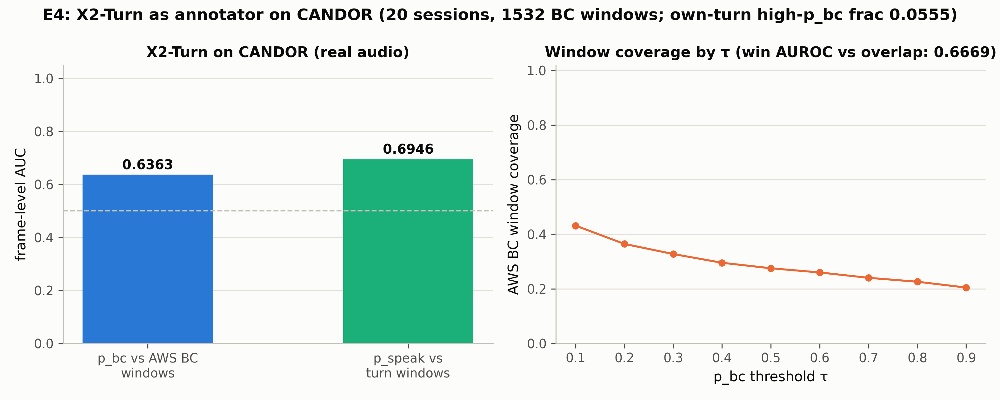

# E4：X2-Turn 在真实对话（CANDOR）上的标注质量

> **日期**：2026-08-26
> **动机**：[E3](2026-08-25_ari_e3_calibration.md) 在合成数据上发现"标签空间错配"
> （64% 触发是说话人自己话轮内的 token），并修正了协议：帧级概率 + 覆盖率口径。
> E4 回答：**在真实录音上，X2-Turn 作为标注器的质量如何？** 这是论文故事 Act 3 的
> 成败手——若插件在真实数据上的标签质量显著超过 L2（AWS/VAD），"模型化标注器"
> 方案就成立。
>
> **脚本**：`pilot_study/scripts/ari_e4_infer.py`（x2-turn 环境，3min 分块+30s 重叠，
> 去重叠拼接验证 0 缺口）+ `ari_e4_analyze.py`
> **数据**：CANDOR 20 会话（27-46 分钟），40 条声道流，1,532 个 AWS BC 窗口，
> 2,712 个事件（含 E1 的声道级 realized 标签）

---

## 1. 结果

| 指标 | CANDOR（真实） | Behavior-SD（合成，E3 对照） |
|---|---|---|
| p_bc 帧级 AUC vs BC 窗口 | **0.636 ± 0.079** | 0.784 |
| p_speak 帧级 AUC vs 话轮（管线合理性） | 0.695 | 0.864 |
| **窗口级 AUROC：max p_bc 判别该 BC 是否真重叠** | **0.667** | — |
| 高 p_bc 帧落在自己话轮内的比例（错配率） | **5.6%** | 64% |
| AWS BC 窗口覆盖率（τ=0.1） | 43.2% | 41.5% |



## 2. 裁决

1. **模型化标注器在真实数据上成立**：p_bc 帧级 AUC 0.636——同一批 AWS BC 窗口，
   E1 里 AWS 标签与 realized 的 κ 只有 0.06，而 X2-Turn 的帧级信号与窗口的
   AUC 达 0.64。**插件信号比 ASR 派生标签强一个数量级地贴合声学现实**。
2. **新发现：模型 BC 信号追踪真实重叠**（窗口级 AUROC 0.667）：BC 窗口内 max p_bc
   越高，该 BC 越可能是声道级 realized 的真重叠。对比 E1 中 VAD 区间规则与 realized
   的 κ=0.24、E2 中 VAD 指标在串扰下的退化——**X2-Turn 是三个 L2 候选里与声学
   现实对齐最好的标签源**。
3. **E3 的错配问题在真实数据上基本消失**（64%→5.6%）：合成数据的 utterance 结构
   （长话轮内嵌短 token）造成了语言学 BC 与 metadata BC 的语义冲突；真实录音的
   AWS 短话轮结构下，模型的 backchannel 状态天然落在"听者时刻"。E3 的教训仍然
   有效（标签空间映射是校准的一部分），但后果在目标域上不严重。
4. **对论文故事的意义**（Act 3 关键数字）：在真实音频上，
   - 帧级标签质量：X2-Turn AUC 0.64 ≫ AWS κ 0.06（vs realized）≳ VAD κ 0.24
   - 覆盖率 43% 与合成域持平——标注器域外退化温和
   - "用合成 GT 校准 → 应用到真实数据"的管线可行：合成域 AUC 0.78 只降到 0.64，
     远高于任何声学派生标签源

## 3. 局限

- 20 会话子集（1,532 个 BC 窗口）；CANDOR 的 BC 窗口本身有位置噪声（E1：
  55% 不在宿主说话期间），AUC 0.64 可能同时低估模型（GT 噪声）与高估
  （串扰泄漏）。
- 错配率 5.6% 依赖 AWS 话轮边界作为"自己话轮"的判据，边界噪声会引入测量误差。
- 分块推理（3min/30s 重叠）在块边界可能损失少量跨块上下文；重叠丢弃策略已验证
  时间轴无缺口。
- 与 E3 相同：模型在真实电话/近场语音上训练，CANDOR 是视频通话录音（域外但
  比合成 TTS 近）。

## 4. 复现

```bash
# 推理 (x2-turn 环境, gpu01/gpu02 单卡)
python scripts/ari_e4_infer.py --n-sessions 20
# 分析 (fd_analysis 环境)
python scripts/ari_e4_analyze.py
```
