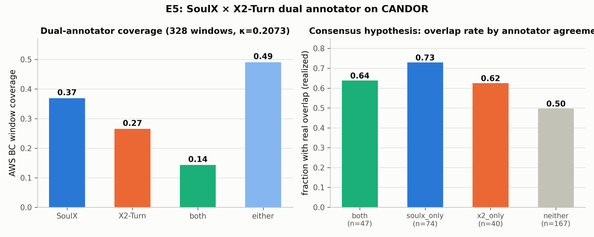

# E5：SoulX-Duplug × X2-Turn 双标注器交叉验证

> **日期**：2026-08-26
> **动机**：[论文故事](2026-08-25_paper_story.md) Act 3 的收尾实验：两个模型化标注器
> 在真实音频上的一致性、互补性与"共识子集假说"（双标注器同时触发的样本是否
> 构成更高置信的标注）。
>
> **脚本**：`pilot_study/scripts/ari_e5_prep.py`（区域准备，soundfile+resample_poly）
> + `e5_soulx_config.yaml`（级联 SenseVoiceSmall，本地权重经符号链接接入 modelscope 缓存；
> asr.py 一行改本地路径）+ `ari_e5_analyze.py`
> **数据**：CANDOR 前 5 会话，328 个 AWS BC 窗口的 ±5s 邻域（262 个区域，~52 分钟音频）

---

## 1. 方法

- **SoulX-Duplug**（0.6B，training-code 分支 `duplex_inference.py`）：160ms/块输出
  speak/wait/backchannel/idle/nonidle。级联 ASR = 本地 SenseVoiceSmall（英文）。
  窗口化推理（BC 邻域区域），时间映射经 manifest 对齐会话时间轴。
- **X2-Turn**（4B）：E4 的全会话 80ms 帧（p_bc），取 τ=0.5 作为触发阈值。
- **GT**：AWS backbiter BC 窗口 + E1 的声道级 realized 重叠标签。

## 2. 结果（328 个 AWS BC 窗口）

| 指标 | 值 |
|---|---|
| SoulX backchannel 覆盖率 | 0.369 |
| X2-Turn 覆盖率（τ=0.5） | 0.265 |
| 双触发（both） | 0.143 |
| 任一触发（either） | 0.491 |
| 窗口级一致率 / κ | 0.652 / **0.207** |

**共识子集假说检验**（分组 realized 真重叠率）：

| 组 | n | 真重叠率 |
|---|---|---|
| both（双触发） | 47 | 0.638 |
| **soulx_only** | 74 | **0.730** |
| x2_only | 40 | 0.625 |
| neither | 167 | 0.497 |



## 3. 裁决

1. **两个标注器的信号都追踪真实重叠**：任一组有触发的窗口，realized 真重叠率
   （0.63-0.73）都显著高于无触发的窗口（0.50）——再次独立证实 E4 的窗口级
   AUROC 0.667 结论，且 SoulX 单发时最高（0.73）。
2. **共识子集假说（简单交集版）不成立**：双触发组（0.638）并不优于最好的单标注器
   （soulx_only 0.730）。两个标注器 κ=0.21，分歧大于一致——它们是两个有不同
   偏差的稀疏检测器，交集过滤丢弃了各自动作对的高置信样本。
3. **对论文故事的实际含义**：模型化标注器方案在真实音频上可用（E4），但
   "双插件交叉验证出高置信子集"的原始设想需要修正——**并集 + 概率融合**比
   交集过滤更合理；或把两个标注器的软概率作为特征融合（如 p_bc 平均）而非
   硬阈值投票。E5 为标注器融合策略提供了直接证据。
4. **覆盖率上限**：任一触发也只覆盖 49% 的 AWS BC 窗口——AWS BC 窗口本身
   有位置噪声（E1：55% 不在宿主说话期间），未覆盖的 51% 部分是标签质量问题
   与检测器上限的叠加；模型化标注器不应被要求复现全部 AWS 标注。

## 4. 局限

- 5 会话子集（328 窗口）；窗口化推理丢失 BC 窗口外的全局上下文（SoulX 的
  流式状态在区域边界重置）。
- SoulX 为中文主导的双语模型，英文域外性能可能低于其生产场景；X2-Turn 的
  τ=0.5 阈值是单点设定（E4 有完整 τ 曲线）。
- "mistake_times: 263" 的 correction 逻辑对状态序列的影响未单独分析。

## 5. 复现

```bash
python scripts/ari_e5_prep.py --n-sessions 5          # 区域 wav + manifest
# SoulX 推理 (kimiev-soulx 环境, training-code 分支)
python scripts/duplex_inference.py --config_path \
  pilot_study/scripts/e5_soulx_config.yaml --eval_dir \
  pilot_study/real_data/results/annotator/e5_regions
python scripts/ari_e5_analyze.py
```
