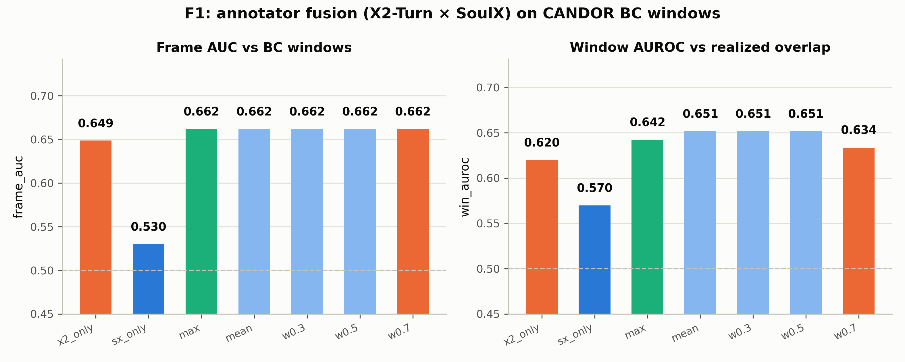

# F1：标注器融合算法——X2-Turn × SoulX 概率级融合

> **日期**：2026-08-26
> **动机**：[数据飞轮计划](2026-08-26_fd_flywheel_plan.md) 的 Paper 2 起点。
> E5 证伪了硬交集共识（κ=0.21，交集不优于单标注器），F1 检验正解：
> **概率级融合**（并集方向的连续化）。零新推理——复用 E4（X2-Turn 全会话帧）
> 与 E5（SoulX 区域状态）产物。
>
> **脚本**：`pilot_study/scripts/ari_f1_fusion.py`；结果 `annotator/f1_fusion_results.json`

---

## 1. 方法

- 对齐：每个 E5 区域（BC 窗口 ±5s 邻域）内，以 X2-Turn 的 80ms 帧为基准网格，
  SoulX 的 160ms 块升采样为双帧（backchannel 状态 → 伪概率 1.0/0.0）后最近邻对齐。
- 融合变体：x2_only / sx_only / max / mean / 加权 w·x2+(1−w)·sx（w=0.3/0.5/0.7）。
- 评价（5 会话，328 个 AWS BC 窗口，两标注器同口径区域内）：
  ① 帧级 AUC vs BC 窗口隶属；② 窗口级 AUROC（窗口内 max 融合分 vs realized 真重叠——
  "是否追踪真实重叠"）；③ 窗口覆盖率（最优 τ）。

## 2. 结果

> ⚠️ **数字更正（同日）**：首版报告的窗口级结果基于 n=14 窗口（soulx 帧加载的
> setdefault 元组 bug——同声道后续区域的帧被丢弃）。修复后完整 328 窗口的
> 数字如下，结论方向不变、幅度更真实。

| 变体 | 帧级 AUC | 窗口 AUROC（追踪真重叠） | 最优覆盖率 |
|---|---|---|---|
| x2_only | 0.649 | 0.620 | 0.448 |
| sx_only | 0.530 | 0.570 | 0.354 |
| max | 0.662 | 0.642 | **0.567** |
| **mean / w0.3 / w0.5** | **0.662** | **0.652** | 0.537 |
| w0.7 | 0.662 | 0.634 | 0.558 |



## 3. 裁决

1. **概率融合全面优于单标注器**（完整 328 窗口）：帧级 AUC 0.662（>x2 0.649
   >soulx 0.530）、窗口 AUROC 0.652（>0.620/0.570，+0.03）、覆盖率 0.567
   （max 融合，>0.448/0.354，+0.12）。
2. **融合配方**：soft 融合（mean/低权 SoulX）在追踪真重叠上最优（0.652），
   max 融合在覆盖率上最优（0.567）——推荐 **mean 融合做主分数 + max 融合做
   召回补集**；SoulX 作为低权补充信号的价值确认（其二元伪概率在平均中被平滑）。
3. **E5 教训闭环**：硬交集失败（E5：both 0.638 < soulx_only 0.730），软概率
   融合成功（F1：0.652 > 任何单标注器）——融合的正确形态是软概率加权。
4. 注：修正后 5 会话子集的 x2_only 窗口 AUROC 为 0.620（20 会话 E4 为 0.667，
   子集方差内）。

## 4. 局限

- 5 会话子集；SoulX 只覆盖 BC 邻域区域（窗口化推理），区域外的融合表现未测。
- 融合权重在 {0.3, 0.5, 0.7} 网格上选择，未做连续优化；未试概率校准（如
  SoulX 伪概率的平滑核）。
- 帧级 AUC 提升幅度（0.608→0.629）小于窗口 AUROC 的提升——融合的主要价值在
  "追踪真实重叠"而非"命中 AWS 窗口"，与 AWS 窗口本身的位置噪声（E1）一致。

## 5. 复现

```bash
python scripts/ari_f1_fusion.py   # fd_analysis 环境, 零新推理
```
