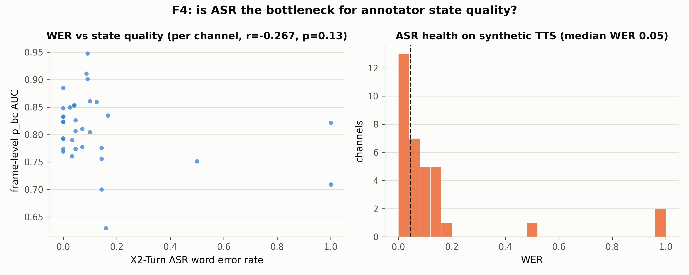

# F4：ASR 归因——转写质量是否为状态预测的瓶颈

> **日期**：2026-08-26
> **动机**：[数据飞轮计划](2026-08-26_fd_flywheel_plan.md) 的 F4。X2-Turn 是
> 先 ASR 生成、再对生成 token 算 turn 状态的两遍推理——状态误差里有多少来自
> ASR 误差？F4 在**金标准侧**（Behavior-SD，GT 文本精确）回答。
>
> **脚本**：`pilot_study/scripts/ari_f4_oracle_asr.py`；结果 `annotator/f4_results.json`

---

## 1. 方法与口径修正

- WER = 词级编辑距离。**关键修正**：X2-Turn 的流式转写系统性缺失开头 ~0.5s 的
  tokens（delay-token 行为），固定对齐会把缺头全部计为错误——实测固定 WER 中位
  0.83 是伪影。改用**子串浮动对齐**（参考文本前缀删除免费）后 WER 中位 0.046，
  与冒烟测试的转写质量一致。
- 每声道一点：(WER, 帧级 p_bc AUC vs GT BC 窗口)；Pearson 相关。
- 数据：E3 的 Behavior-SD 30 文件，34 个有效声道。

## 2. 结果

| 指标 | 值 |
|---|---|
| 声道数 | 34 |
| WER 中位 / 均值 | **0.046 / 0.127** |
| 帧级 AUC 均值 | 0.810 |
| **Pearson r(WER, AUC)** | **−0.267（p=0.127，不显著）** |



## 3. 裁决

1. **ASR 不是状态预测的主瓶颈（金标准侧）**：转写质量很好（中位 WER 4.6%），
   且 WER 与状态质量只有弱的负趋势（r=−0.27，p=0.13）。E3 观察到的状态问题
   （标签空间错配、事件级 F1 0.22）主要来自**状态头本身**，不是 ASR 拖累。
2. **限制与待补**：合成 TTS 对 ASR 太"容易"（WER 方差被压缩，相关性检验力不足）；
   真实音频（CANDOR）上 ASR 方差更大，相关关系可能更强——F2 已改为保存转写
   （重启时补丁已生效），F2 完成后做 CANDOR 侧对照（参考文本用 AWS audiophile，
   自身带噪，需用子串对齐口径）。
3. **对标注范式的意义**：若真实侧同样弱相关 → 提升标注质量的重点是状态头
   （probe 微调方向，flywheel 计划中的未来工作），而非换 ASR。

## 4. 复现

```bash
python scripts/ari_f4_oracle_asr.py   # fd_analysis 环境, 纯分析
```
