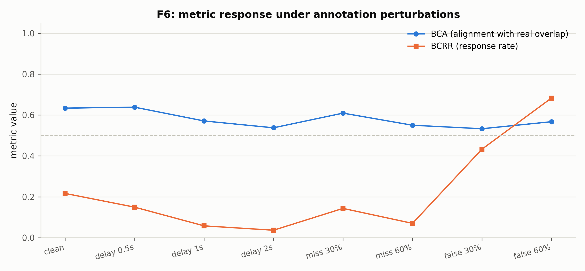

# F6：鲁棒指标定义与敏感性验证（v0）

> **日期**：2026-08-26
> **动机**：[数据飞轮计划](2026-08-26_fd_flywheel_plan.md) 评测端起点：在 L3 融合
> 标注上定义全双工指标集，并用扰动实验证明指标的响应特性。
> **v0 范围**：标注噪声鲁棒性（扰动融合分数）；行为敏感性（模型输出流的
> 延迟/漏 BC/误触发）留待 F7（真实模型输出）实现。
>
> **脚本**：`pilot_study/scripts/ari_f6_metrics.py`；结果 `annotator/f6_results.json`

---

## 1. 指标定义（L3 融合标注上，窗口级聚合）

| 指标 | 定义 | 测什么 |
|---|---|---|
| **BCRR**（Backchannel Response Rate） | 融合分 ≥ τ 的 BC 窗口占比 | BC 行为密度/响应性 |
| **BCA**（Backchannel Alignment） | 窗口 max 融合分 vs 声道级 realized 真重叠的 AUROC | BC 是否落在真实重叠上 |
| TBR（Turn-Boundary Responsiveness） | 预留：对方 turn_end → 本侧发声的延迟（需模型输出流，F7） | 轮转响应性 |

主分数 = mean 融合（F1 的 0.652 配置），τ=0.5。

## 2. 敏感性结果（328 窗口，扰动融合分数）

| 扰动 | BCRR | BCA |
|---|---|---|
| clean | 0.217 | 0.634 |
| 延迟 0.5s | 0.149 | 0.638 |
| 延迟 1s | 0.058 | 0.571 |
| 延迟 2s | 0.037 | 0.538 |
| 漏检 30% | 0.143 | 0.609 |
| 漏检 60% | 0.070 | 0.550 |
| 误报 30% | 0.433 | 0.533 |
| 误报 60% | 0.683 | 0.567 |



## 3. 裁决

1. **两指标互补，必须成对报告**：
   - BCRR 对延迟与漏检单调响应（0.22→0.04 / 0.22→0.07），但被误报**抬高**
     （0.22→0.68）——BCRR 单独无法区分"模型真做 BC"与"模型幻觉 BC"；
   - BCA 对延迟（≥1s）与误报响应（0.63→0.54 / 0.63→0.53），但对漏检弱
     （0.63→0.55）——漏检主要伤 BCRR。
   - **指标对 (BCRR, BCA) 联合报告**可覆盖三种失效模式：漏检（BCRR↓）、
     误报（BCRR↑ 且 BCA↓）、延迟（双降）。
2. **灵敏度下限 ≈1s**：0.5s 延迟在窗口级 max 聚合下几乎不可见（BCA 0.638 vs
   clean 0.634）——窗口粒度（0.6s 的 BC 窗口）与聚合方式限制了时间分辨率；
   需要更细时间分辨率的场景应改用帧级对齐指标（F7 的 TBR 方向）。
3. **对评测端的意义**：给出第一版可落地的 L3 指标对 + 已知的响应特性表
   （用于 F7 解读真实模型输出的指标行为），并再次确认无捷径协议的必要性——
   这些指标都建立在 realized/声学验证之上，天然附带审计口径。

## 4. 局限

- 扰动在"标注器分数"层注入，不等同于模型行为扰动（F7 补）；扰动水平未做
  随机重复（单种子）。
- τ=0.5 为单点设定；τ 曲线见 F1 报告的覆盖率列。
- BCA 在误报 60% 时略高于 30%（0.567 vs 0.533），可能来自高分平局的 AUROC
  平均效应，方向性结论以 clean 对照为准。

## 5. 复现

```bash
python scripts/ari_f6_metrics.py   # fd_analysis 环境, 纯分析
```
