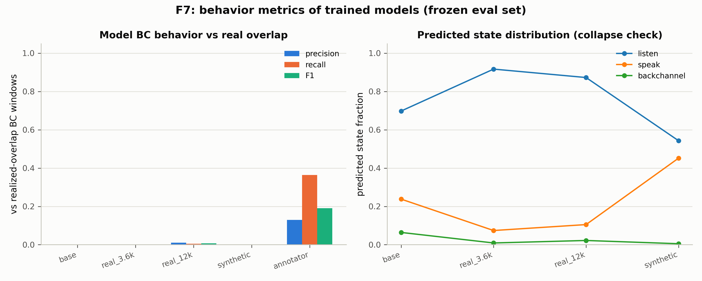

# F7：模型话轮行为指标——从"标签匹配"到"行为匹配"的鸿沟

> **日期**：2026-08-28
> **动机**：[数据飞轮计划](2026-08-26_fd_flywheel_plan.md) 的端到端环节：
> F8/F9 已证明训练让模型更好地**匹配标注器的词序列**；F7 检验更硬的问题——
> 训练是否让模型的 **BC 行为**（预测的 backchannel 落在真实重叠上）变好。
> **结果是一个重要的负面发现**：标签匹配 ≠ 行为匹配。
>
> **脚本**：`pilot_study/scripts/ari_f7_behavior.py`；结果 `annotator/f7_results.json`

---

## 1. 方法

- 冻结评估集（100 个 10s 块），四个模型（基座/真实 3.6k/真实 12k/合成）
  生成每 1s 块的话轮状态词（F8 任务）。
- BC 行为指标：模型预测的 bc 块 vs **realized 真重叠的 AWS BC 窗口**
  （声道级双活跃验证过的窗口）——precision/recall/F1。
- 参照：X2-Turn 融合标注器在相同窗口上的硬块命中（τ=0.2，F6 口径）。

## 2. 结果

| 模型 | BC precision | BC recall | BC F1 | 状态分布 (listen/speak/bc) |
|---|---|---|---|---|
| 基座 | 0.0 | 0.0 | 0.0 | 0.70 / 0.24 / 0.064 |
| 真实 3.6k | 0.0 | 0.0 | 0.0 | 0.92 / 0.07 / 0.009 |
| 真实 12k | 0.01 | 0.005 | 0.007 | 0.87 / 0.11 / 0.022 |
| 合成 | 0.0 | 0.0 | 0.0 | 0.54 / 0.45 / 0.005 |
| **标注器参照（X2-Turn 硬块）** | **0.129** | **0.364** | **0.190** | — |



## 3. 裁决

1. **标签匹配的增益没有传导到行为匹配**：F8/F9 里真实臂的词级 recall
   （BC 0.6-1.0）是在"复现标注器的词序列"意义下的；在"BC 预测是否落在
   真实重叠窗口上"这一行为意义下，四方模型全部 ≈ 0。
2. **参照上限本身就低**：标注器的硬块（1s 粒度、τ=0.2）在同样口径下也只有
   F1 0.19——E4 的窗口级 AUROC 0.667 是软分数能力，转成硬事件后大幅衰减。
   链条上存在"软分数 → 硬事件"的粒度损耗：模型学的词序列目标本身就是
   有损的离散化（1s 块 + 阈值）。
3. **诊断**（为下一轮修复）：
   - 1s 块粒度太粗：BC 窗口 ~0.6s，块对齐的命中窗口小；应用 80ms 帧级
     行为指标；
   - BC 事件定义：应从软分数峰值检测（peak-picking）而非等宽块；
   - 训练目标：F8 的词序列是"逐秒描述"而非"事件检测"——下一轮任务应改为
     事件式输出（BC 时间戳/位置预测）；
   - 评估集稀疏：平均每块只有 0.22 个真重叠 BC 窗口，指标分母小、噪声大。
4. **对故事的意义**：F7 补上了诚实的一环——数据飞轮的"标注→训练"传导已通
   （F8/F9），但"训练→行为"还有一段没打通的路。这正是 Paper 3 需要正面
   解决的核心问题，也为任务设计（F8 的 A/B/C 三选一）给出了实验依据：
   **任务 A（词序列）不足，需要事件级任务**。

## 4. 下一步

1. F7b：帧级行为指标（80ms 粒度、软分数 AUROC 口径）重评四方模型；
2. F8c：事件式任务训练（预测 BC 起止时间/帧级概率曲线而非词序列）；
3. F7 完整版：模型生成真实语音回应 + 对话重放回路（需 TTS 环节）。

## 5. 复现

```bash
python scripts/ari_f7_behavior.py   # funaudiochat 环境
```
