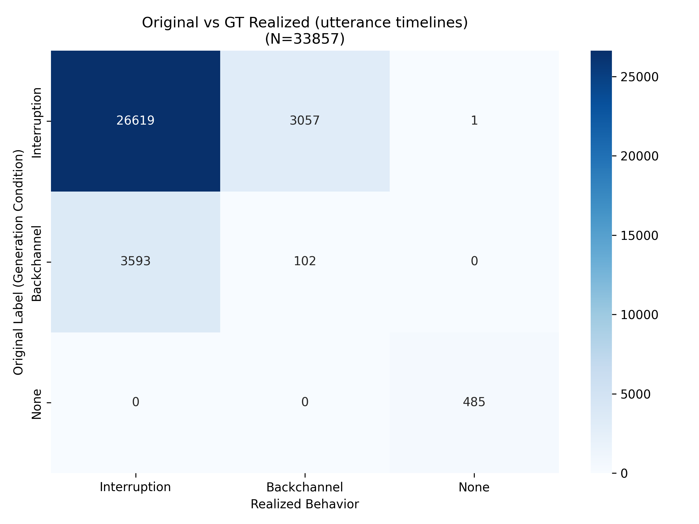
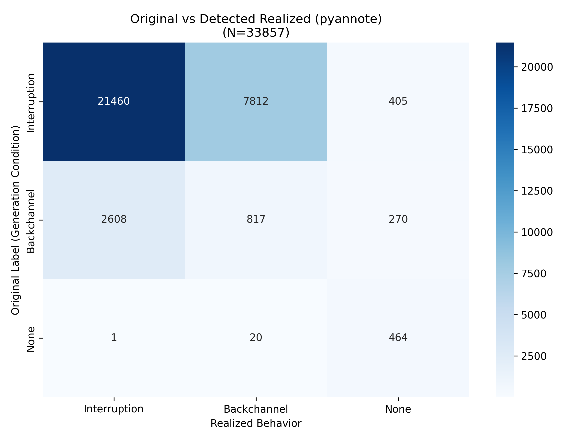

# Behavior-SD 真实数据验证报告 (validation + test + train)

> ⚠️ **勘误（2026-09-23 补挂横幅）—— 本文的 GT 侧已作废，别引用 §1 与 §2.1。**
> 本文跑在 **reduced metadata** 上：`prepare_real_data.py` 当初只保留顶层 utterances，
> **丢弃了嵌套的 `backchannels` 数组**（每条 bc 自带 `start_time/end_time`，
> 位于宿主 utterance 窗口内部）。因此本文里所有以 "GT 实现" 为对照的结论
> —— §1 的 GT 那一列、**§2.1 整张混淆矩阵**、§3 第 1 条那句
> 「GT 是 TTS 实际渲染时序」—— **都建立在被撤回的 GT 上**。
> 🔁 **修正版见 [`../log/2026-08-21_metadata_rebuild_and_reeval.md`](../log/2026-08-21_metadata_rebuild_and_reeval.md)**
> （从 tar 重解官方 JSON、原样保留全部字段后重评）：标签 vs GT 一致率
> **78.8%（旧口径 27.0% 是伪象）**、标签→元数据实现率 **100%**、
> 检测器有效性 **r = 0.855（旧 0.281 是伪象）**。
> ⚠️ **一个未解决的差异，如实留着**：本文报的标签 vs GT 一致率是 **80.4%**，
> 与修正版的 **78.8%** 不同 —— 但**两者样本范围不一样**
> （本文含 train 32000，修正版是 val+test 的 1,857），
> **所以这两个数不能直接比，也不该互相"对账"**。谁对谁错**没有查**。
> 📌 本文档仅作**阶段 0 存档**保留。

- 数据: /share/workspace3/shared_dataset/behavior-sd (validation 932, test 925, train 32000)
- 模型: pyannote/speaker-diarization-3.1 + whisper-large-v3 (4× RTX 4090 D)
- 判定规则: 事件级重叠 (>0.5s -> Interruption; 0.1-0.5s -> Backchannel; 否则 None)

## 1. 标签分布

| 类别 | Generation 标签 | GT 实现 | 检测实现 |
|------|----------------|---------|----------|
| Interruption | 29677 | 30212 | 24069 |
| Backchannel | 3695 | 3159 | 8649 |
| None | 485 | 486 | 1139 |

## 2. 核心结果

- **标签 vs GT 实现一致率: 80.4%** (不一致率 19.6%)
- **标签 vs 检测实现一致率: 67.2%** (不一致率 32.8%)
- 检测器有效性: GT vs 检测重叠总量 Pearson r = 0.857 (n=33857)

### 2.1 混淆矩阵: 标签 vs GT (utterance 时间线)

|                    |   real=Interruption |   real=Backchannel |   real=None |
|:-------------------|--------------------:|-------------------:|------------:|
| label=Interruption |               26619 |               3057 |           1 |
| label=Backchannel  |                3593 |                102 |           0 |
| label=None         |                   0 |                  0 |         485 |

### 2.2 混淆矩阵: 标签 vs 声学检测 (pyannote)

|                    |   real=Interruption |   real=Backchannel |   real=None |
|:-------------------|--------------------:|-------------------:|------------:|
| label=Interruption |               21460 |               7812 |         405 |
| label=Backchannel  |                2608 |                817 |         270 |
| label=None         |                   1 |                 20 |         464 |

## 3. 解读

1. GT (utterance 时间线) 是 TTS 实际渲染时序, 代表"声学可实现的重叠";
   检测结果代表独立声学测量。两者与生成标签的差距即为标签-实现不一致。
2. Backchannel 为轻声短插入, 声学检测天然更难; 若标签-vs-GT 一致率高而
   标签-vs-检测一致率低, 说明 gap 主要来自检测难度而非标签错误。

## 4. 结论与后续

- 🔁 **后续请读修正版**：[`../log/2026-08-21_metadata_rebuild_and_reeval.md`](../log/2026-08-21_metadata_rebuild_and_reeval.md)
  （原指针写的是 `docs/log/2026-08-21_real_data_run.md` —— **路径不对，而且指向的那篇
  自己的头部就挂着「GT 结论已作废」的勘误**。2026-09-23 改指修正版。）
